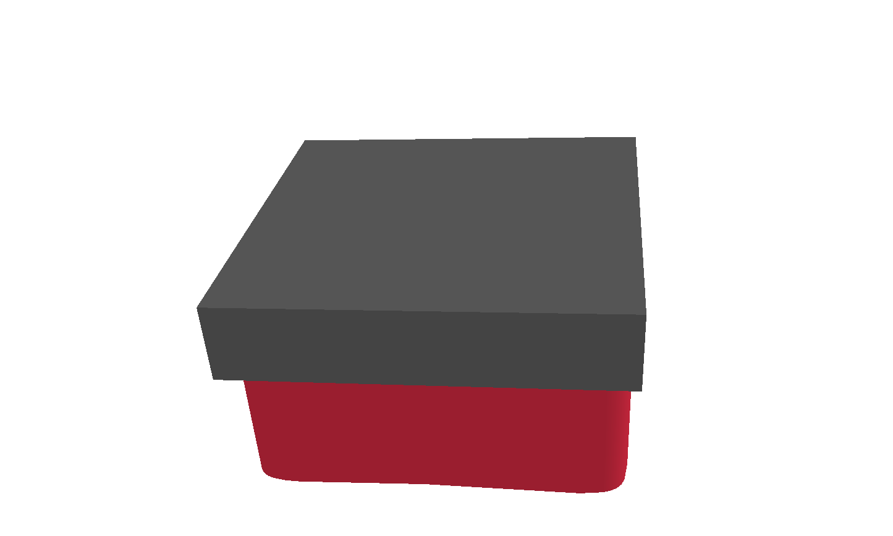
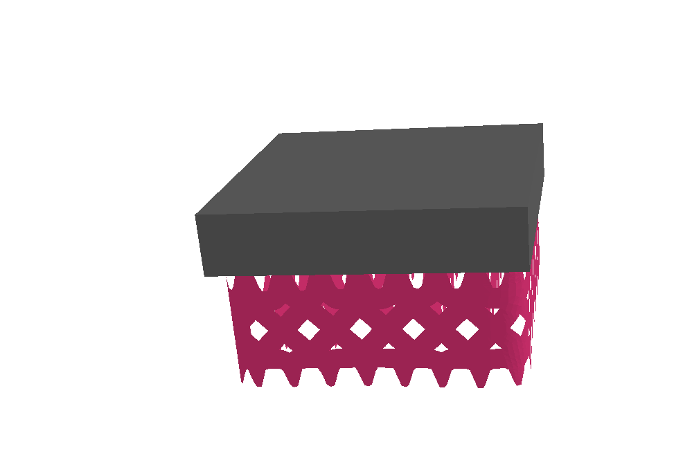
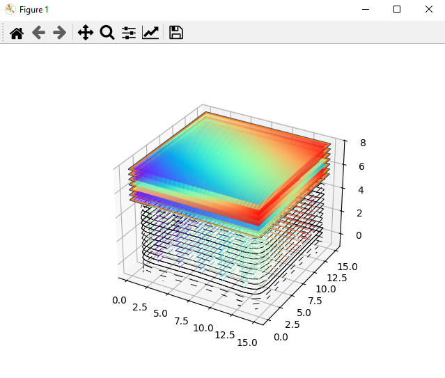

# PySLM Unified Additive Manufacturing Pipeline

This repository provides a comprehensive suite of Python scripts designed to automate and assist in the preparation of 3D models (STL files) for additive manufacturing. It covers essential steps including support generation, slicing into 2D layers (DXF), cleaning DXF files, converting them to machine-specific formats, and generating manufacturing parameters. The primary script for a consolidated workflow is `unified_pyslm_pipeline.py`, though individual scripts are also available for specific tasks.

## Features

  * **Flexible Workflows:**
      * **1-3-4 Pipeline:** Original STL to a new STL with generated PySLM supports.
      * **1-3-5 Pipeline:** Original STL to DXF slices (raw, cleaned, and machine-ready) with PySLM supports.
      * **2-5 Pipeline:** Already supported STL to DXF slices (raw, cleaned, and machine-ready).
  * **Support Generation:** Generates block support structures for STL models based on overhang angles.

    
    

  * **Slicing:** Slices 3D models (with or without supports) into 2D layers and exports them as individual DXF files.

    

  * **DXF Processing:**
      * Extracts and simplifies line entities from DXF files for cleaner output.
      * Converts DXF layers into a highly simplified textual format, suitable for specific laser or manufacturing machines.
  * **Manufacturing Parameter Generation:** Automatically analyzes machine-ready DXF/TXT files and generates a manufacturing parameters file, including bounding box dimensions and layer count.
  * **Visual Previews:** Offers interactive 3D visualizations of generated supports and sliced layers (requires closing windows to proceed).
  * **Timestamped Outputs:** All generated output files and folders are timestamped for easy organization and version control.

## Prerequisites

Before running the scripts, ensure you have the necessary Python libraries installed. You can install them using `pip`:

```bash
pip install ezdxf trimesh numpy tqdm matplotlib pyslm
````

You might also need `vispy` for some visualizations if it's not automatically installed by `pyslm`:

```bash
pip install vispy
```

## Code Structure and Blocks Explained

The pipeline is organized into several key functional blocks. The `unified_pyslm_pipeline.py` script consolidates many of these steps.

### Global Constants

  * `OVERHANG_ANGLE`: Defines the angle (in degrees) used to identify overhang regions that require support. Regions with an angle greater than this value will not need support.
  * `LAYER_THICKNESS`: Defines the thickness (in millimeters) of each sliced layer. This is a critical parameter for both slicing and 3D model reconstruction from DXFs. A smaller value results in more layers and higher precision but increases processing time.

### 1\. Reading Pure STL (Original)

This block involves loading an original STL file that does not yet have support structures.

  * **Location**: Used within the `run_original_stl_to_supported_stl` and `run_original_stl_to_dxf_pipeline` functions.
  * **Input Path**: The script expects these files to be located in the `models/original/Peca/` directory relative to the script.

### 2\. Reading Already Supported STL

This block handles loading an STL file that has already been pre-processed to include support structures (e.g., generated by other CAD software like Siemens NX or SolidWorks).

  * **Location**: Used within the `run_supported_stl_to_dxf_pipeline` function.
  * **Input Path**: The script expects these files to be located in the `models/original/suporte/` directory relative to the script. When this pipeline runs, the script will explicitly print the full path from where it's loading the STL.

### 3\. Creating PySLM Supports

This block generates support structures using PySLM's `GridBlockSupportGenerator`.

  * **Location**: Centralized in the `get_pyslm_support_generator()` function. This function is called by `run_original_stl_to_supported_stl` and `run_original_stl_to_dxf_pipeline`.
  * **Functionality**: It identifies overhang regions based on `OVERHANG_ANGLE` and constructs a lattice-like support geometry.
  * **Visual Preview**: Whenever this block is executed, the script will open two interactive visualization windows: one showing the raw block support volumes alongside your part and overhang regions, and another displaying the final, refined mesh support structures. You must close these visualization windows for the script to continue.

### 4\. Exporting STL with PySLM Supports

This block combines the original 3D model with the newly generated PySLM support structures and exports them as a single STL file.

  * **Location**: Performed at the end of the `run_original_stl_to_supported_stl` function.
  * **Output**: The generated STL file will be saved in the timestamped output folder (e.g., `dxfs/YourPart_YYYYMMDDHHMM/`), with a timestamped filename like `YourPart_combined_supported_YYYYMMDDHHMM.stl`.

### 5\. Slicing Part with DXF

This block is responsible for slicing the 3D model (either original with PySLM supports, or a pre-supported one) into 2D layers and exporting them as DXF files. It also includes steps for cleaning these DXFs and converting them to a machine-compatible format.

  * **Location**: The core slicing logic is in `_slice_and_export_dxf_layers`, which is called by `run_original_stl_to_dxf_pipeline` and `run_supported_stl_to_dxf_pipeline`.
  * **Sub-stages**: This block comprises three internal stages when run as part of the `1-3-5` or `2-5` pipelines:
    1.  **Raw DXF Generation**: Slices the part (and supports, if applicable) and exports basic DXF files to `dxf_bruto/`.
    2.  **DXF Cleaning**: Reads the raw DXFs, extracts only line segments, and writes simplified DXF files to `dxf_clean/`. It can also optionally reconstruct and save a combined 3D STL model from these cleaned layers.
    3.  **Machine Format Conversion**: Converts the cleaned DXF files into a specific machine-readable format (a simplified ASCII DXF structure) and saves them to `txt_maquina/`.
  * **Manufacturing Parameters**: After the machine-format DXFs are generated, the script will also create an `auto_machine_parameters.txt` file in the main timestamped output folder, containing relevant manufacturing parameters like layer count and bounding box.

## How to Use

### Unified Pipeline (`unified_pyslm_pipeline.py`)

This script provides a consolidated workflow for preparing 3D models. Navigate to your `Final_pipeline` directory in your terminal and run the script using the following general command:

```bash
python unified_pyslm_pipeline.py <model_name> <pipeline_type> [start_stage_for_dxf_pipelines]
```

  * `<model_name>`: The base name of your STL file (e.g., `Palet`). The script will look for `Palet.stl` in the appropriate input directory (`models/original/Peca/` or `models/original/suporte/`).
  * `<pipeline_type>`: Specifies the main workflow to execute. Choose one of:
      * `1-3-4`: Original STL -\> Generate PySLM Supports -\> Export Supported STL.
      * `1-3-5`: Original STL -\> Generate PySLM Supports -\> Full DXF Slicing Pipeline (Raw -\> Clean -\> Machine Format).
      * `2-5`: Already Supported STL -\> Full DXF Slicing Pipeline (Raw -\> Clean -\> Machine Format).
  * `[start_stage_for_dxf_pipelines]`: (Optional) This argument is only relevant for `1-3-5` and `2-5` pipelines if you want to resume from a specific point.
      * `1`: (Default) Start from generating raw DXFs.
      * `2`: Start from cleaning raw DXFs (assumes raw DXFs already exist in the output folder).
      * `3`: Start from converting clean DXFs to machine format (assumes clean DXFs already exist).

**Examples for `unified_pyslm_pipeline.py`:**

1.  **Run Pipeline 1-3-4 (Original STL to Supported STL):**

    ```bash
    python unified_pyslm_pipeline.py MyPart 1-3-4
    ```

    *(This will read `models/original/Peca/MyPart.stl`, generate supports, show previews, and save `dxfs/MyPart_YYYYMMDDHHMM/MyPart_combined_supported_YYYYMMDDHHMM.stl`)*

2.  **Run Pipeline 1-3-5 (Original STL to Machine DXF - Full Pipeline):**

    ```bash
    python unified_pyslm_pipeline.py MyPart 1-3-5
    ```

    *(This will read `models/original/Peca/MyPart.stl`, generate supports, show previews, and then proceed through raw DXF slicing, cleaning, and machine format conversion, saving all outputs in `dxfs/MyPart_YYYYMMDDHHMM/`)*

3.  **Run Pipeline 1-3-5 (Original STL to Machine DXF - Resume from Clean DXF Stage):**

    ```bash
    python unified_pyslm_pipeline.py MyPart 1-3-5 2
    ```

    *(This assumes raw DXFs for `MyPart` already exist in the latest timestamped `dxfs/MyPart_YYYYMMDDHHMM/dxf_bruto/` folder and will start processing from the DXF cleaning stage.)*

4.  **Run Pipeline 2-5 (Already Supported STL to Machine DXF - Full Pipeline):**

    ```bash
    python unified_pyslm_pipeline.py SupportedPart 2-5
    ```

    *(This will read `models/original/suporte/SupportedPart.stl`, proceed through raw DXF slicing, cleaning, and machine format conversion, saving all outputs in `dxfs/SupportedPart_YYYYMMDDHHMM/`)*

### Legacy Individual Scripts

For more granular control or specific tasks, individual scripts are also provided. They generally follow a sequential flow to prepare your model.

**1. `STL_to_support_STL.py`**

  * **Purpose:** Generates block support structures for your original STL model and saves the combined model (part + supports) to a new STL file.
  * **How to Use:**
    ```bash
    python STL_to_support_STL.py <ModelName>
    ```
    Example: `python STL_to_support_STL.py Aleta_mini`
  * **Input:** Original STL file at `models\original\Peca\<ModelName>.stl`.
  * **Output:** New STL with part and supports at `models\support\<ModelName>\<ModelName>_support.stl` (your **STL\_support**).

**2. `STL_to_support_DXF.py`**

  * **Purpose:** Generates supports for your original STL, slices both part and supports into 2D layers, and exports each layer as a separate DXF file. This is the most direct path to get your DXF layers with supports.
  * **How to Use:**
    ```bash
    python STL_to_support_DXF.py <ModelName>
    ```
    Example: `python STL_to_support_DXF.py Aleta_mini`
  * **Input:** Original STL file at `models\original\Peca\<ModelName>.stl`.
  * **Output:** Folder with multiple DXF files, each representing a slice of the part and its supports, saved in `dxfs\<ModelName>\dxf_bruto` (your **DXF\_support**).

**3. `STL_solid_support_to_DXF.py`**

  * **Purpose:** A more generic slicing script that takes an existing STL file (which can be a solid part **or an STL that already includes supports, such as generated by `STL_to_support_STL.py`**) and slices it into 2D layers, exporting each layer as a DXF file.
  * **How to Use:**
    ```bash
    python STL_solid_support_to_DXF.py <ModelName>
    ```
    Example: `python STL_solid_support_to_DXF.py Palet_block_pin`
  * **Input:** STL file (solid part or with supports) at `models\original\Peca\<ModelName>.stl` or the previously generated **STL\_support** (if `base_models_path` is adjusted in the script to the `models\support` folder).
  * **Output:** Folder with DXF files for each layer of the input STL, saved in `dxfs\<ModelName>\dxf_bruto`.

**4. `support_DXF_to_clean_DXF.py`**

  * **Purpose:** Processes a folder of raw or clean DXF files. It extracts and simplifies line entities, creating new "cleaned" DXF files more suitable for further processing. Optionally, it can create a 3D model from the DXF layers.
  * **How to Use:**
    ```bash
    python support_DXF_to_clean_DXF.py <ModelName> <FolderType>
    ```
    `<FolderType>` can be `bruto` (for `dxfs\<ModelName>\dxf_bruto`) or `clean` (for `dxfs\<ModelName>\dxf_clean`).
    Example: `python support_DXF_to_clean_DXF.py Aleta_mini bruto`
  * **Input:** A folder containing your DXF layer files (your **DXF\_support** or **DXF\_clean** files).
  * **Output:**
      * A new folder with simplified DXF files in `dxfs\<ModelName>\dxf_clean` (your **DXF\_clean**).
      * A combined 3D model (STL) saved in `models\output_3d\<ModelName>_3d_model_from_<FolderType>.stl`.

**5. `support_DXF_to_machine_TXT_or_DXF.py`**

  * **Purpose:** Converts DXF layer files (clean or raw) to a highly simplified textual format, specific for certain laser or manufacturing machines. You can choose the file extension as `.txt` or `.dxf`, but the content will always be in the simple text format compatible with the machine.
  * **How to Use:**
    ```bash
    python support_DXF_to_machine_TXT_or_DXF.py <ModelName> <FolderType>
    ```
    `<FolderType>` can be `bruto` (for `dxfs\<ModelName>\dxf_bruto`) or `clean` (for `dxfs\<ModelName>\dxf_clean`).
    Example: `python support_DXF_to_machine_TXT_or_DXF.py Aleta_mini clean`
  * **Input:** A folder containing your DXF layer files (preferably your **DXF\_clean**, or directly **DXF\_support** if cleaning is not necessary).
  * **Output:** A new folder with machine-ready files, with `.txt` or `.dxf` extension (e.g., `cleaned_sua_peca_layer0_0.txt`), saved in `dxfs\<ModelName>\txt_machine` (your **DXF\_machine\_TXT\_or\_DXF**).

**6. `manufacture_parameters.py`**

  * **Purpose:** Analyzes machine-ready DXF/TXT layer files and automatically generates a manufacturing parameters file. This file will include information such as bounding box dimensions and layer count, combined with predefined or custom machine settings.
  * **How to Use:** This script is not modified for command-line arguments. Adjust paths directly in the script.
  * **Input:** A folder containing your machine-ready DXF/TXT layer files (your **DXF\_machine\_TXT\_or\_DXF**).
  * **Output:** A single text file containing all manufacturing parameters (e.g., `auto_machine_parameters.txt`).

## Where to Edit Parameters

### Global Constants

  * `OVERHANG_ANGLE`: Located at the top of `unified_pyslm_pipeline.py` and in `final_STL_to_machine_TXT.py` (line 31). Defines the angle for overhang detection.
  * `LAYER_THICKNESS`: Located at the top of `unified_pyslm_pipeline.py` and in `final_STL_to_machine_TXT.py` (line 32). Defines the thickness of each sliced layer.

### Part Transformation Parameters (in `final_STL_to_machine_TXT.py` and `unified_pyslm_pipeline.py`)

  * `myPart.rotation`: Located around line 278 within "Etapa 1" of `final_STL_to_machine_TXT.py`. An array `[X, Y, Z]` defining the part's rotation in degrees around X, Y, and Z axes. This allows orienting the part on the build platform. In `unified_pyslm_pipeline.py`, this is within the `run_original_stl_to_dxf_pipeline` and `run_supported_stl_to_dxf_pipeline` functions.
  * `myPart.scaleFactor`: Located around line 279 within "Etapa 1" of `final_STL_to_machine_TXT.py`. A multiplicative factor to adjust part size (e.g., `1.0` for original, `0.5` for half size). Similarly adjustable in `unified_pyslm_pipeline.py`.

### Support Generation Parameters (Block 3 - `get_pyslm_support_generator()` function)

To modify the behavior of the PySLM support generation, edit the `get_pyslm_support_generator()` function directly in the `unified_pyslm_pipeline.py` script. In `final_STL_to_machine_TXT.py`, these are lines 285-302. Here you can adjust parameters such as:

  * `rayProjectionResolution`
  * `innerSupportEdgeGap` and `outerSupportEdgeGap`
  * `minimumAreaThreshold`
  * `triangulationSpacing`
  * `simplifyPolygonFactor` (in `final_STL_to_machine_TXT.py`)
  * `supportBorderDistance`
  * `numSkinMeshSubdivideIterations`
  * `useUpperSupportTeeth` and `useLowerSupportTeeth`
  * `supportWallThickness`
  * `supportTeethTopLength`, `supportTeethHeight`, `supportTeethBaseInterval`, `supportTeethUpperPenetration`, `supportTeethBottomLength`
  * `trussWidth` (in `unified_pyslm_pipeline.py`)
  * `splineSimplificationFactor`
  * `gridSpacing` (e.g., `[X, Y]` distance between inner support walls)

### Slicing Parameters (Block 5)

  * **Layer Thickness**: The global constant `LAYER_THICKNESS` at the top of the script controls the thickness of each slice. This value should be consistent with your manufacturing process.
  * **Hatching Parameters**: The hatching properties (e.g., `hatchAngle`, `volumeOffsetHatch`, `spotCompensation`, `stripeWidth`, `numInnerContours`, `numOuterContours`, `hatchSortMethod`) are defined within the `_slice_and_export_dxf_layers` function using the `pyslm.hatching.Hatcher()` object in `unified_pyslm_pipeline.py`. In `final_STL_to_machine_TXT.py`, these are lines 282-290. You can adjust these values directly in that function if needed.

### Input/Output Path Configuration

The script now allows flexible configuration of input and output base paths directly within the `unified_pyslm_pipeline.py` file. This is particularly useful for managing files in different directory structures or for sharing the code on platforms like GitHub without including large model files.

To customize the paths, open `unified_pyslm_pipeline.py` and navigate to the `--- PATH CONFIGURATION ---` section at the top of the script.

You will find the following variables that you can modify:

  * `BASE_MODELS_ORIGINAL_PECA`: Base path for original, unsupported STL files.
  * `BASE_MODELS_ORIGINAL_SUPORTE`: Base path for STL files that already contain supports.
  * `BASE_DXFS_PATH`: Base path for all generated DXF outputs and other related files.

**Options for defining paths:**

1.  **Default (Relative to Script Directory):**
    By default, the script uses paths relative to its own location. If your `models/` and `dxfs/` folders are kept alongside the script, no changes are needed here.

    ```python
    _script_dir_ = pathlib.Path(__file__).parent
    BASE_MODELS_ORIGINAL_PECA = _script_dir_ / "models" / "original" / "Peca"
    BASE_MODELS_ORIGINAL_SUPORTE = _script_dir_ / "models" / "original" / "suporte"
    BASE_DXFS_PATH = _script_dir_ / "dxfs"
    ```

2.  **Absolute Paths:**
    You can uncomment and edit these lines to specify absolute paths on your system. Remember to use raw strings (`r"..."`) on Windows to handle backslashes correctly.

    ```python
    # Example of an absolute path (change to your actual path):
    # BASE_MODELS_ORIGINAL_PECA = pathlib.Path(r"C:\Users\YourUser\Documents\My3DModels\OriginalParts")
    # BASE_MODELS_ORIGINAL_SUPORTE = pathlib.Path(r"C:\Users\YourUser\Documents\My3DModels\SupportedModels")
    # BASE_DXFS_PATH = pathlib.Path(r"C:\Users\YourUser\Documents\DXFOutputs")
    ```

3.  **Relative to User's Home Directory:**
    This option provides good portability across different machines and users. `pathlib.Path.home()` resolves to the current user's home directory.

    ```python
    # Example of path relative to user's HOME directory:
    # home_dir = pathlib.Path.home()
    # BASE_MODELS_ORIGINAL_PECA = home_dir / "Additive_Manufacturing_Data" / "models" / "original" / "Peca"
    # BASE_MODELS_ORIGINAL_SUPORTE = home_dir / "Additive_Manufacturing_Data" / "models" / "original" / "suporte"
    # BASE_DXFS_PATH = home_dir / "Additive_Manufacturing_Data" / "dxfs"
    ```

**Instructions for Editing:** Choose **only one** of the path definition options (Default, Absolute, or Relative to Home) by uncommenting the relevant lines and modifying the paths as needed for your specific setup. Ensure the `BASE_DXFS_PATH` leads to a writable directory.

## Important Notes

  * **Visualization Windows**: When support previews or layer plots appear, you must close them for the script to continue execution.
  * **Error Handling**: The scripts include basic error handling for file operations and DXF reading. Check the console output for any warnings or errors.
  * **File Naming**: Ensure your STL input files are named simply (e.g., `MyPart.stl`) as the script constructs full paths and output filenames based on this base name.